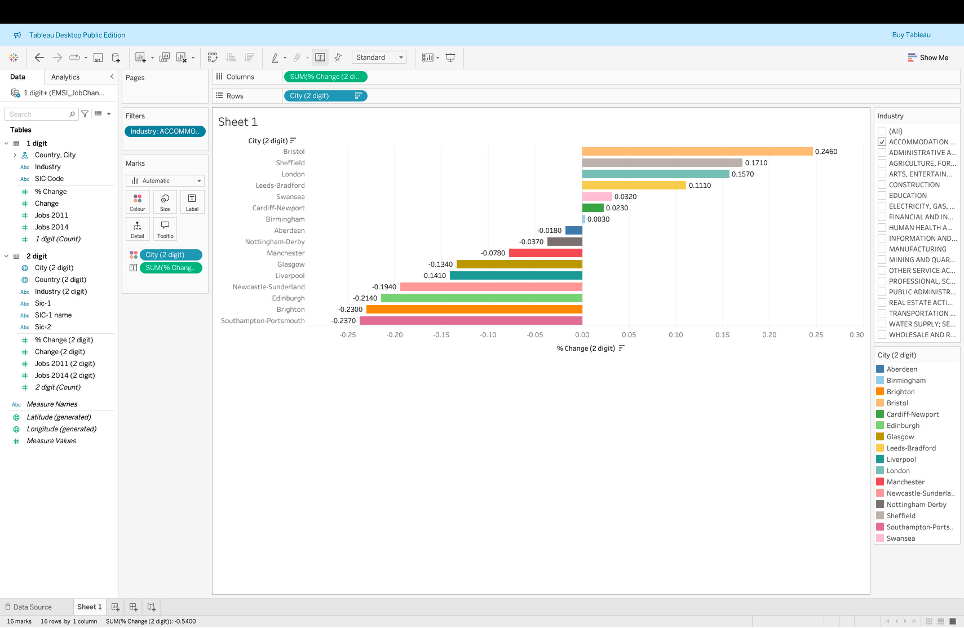
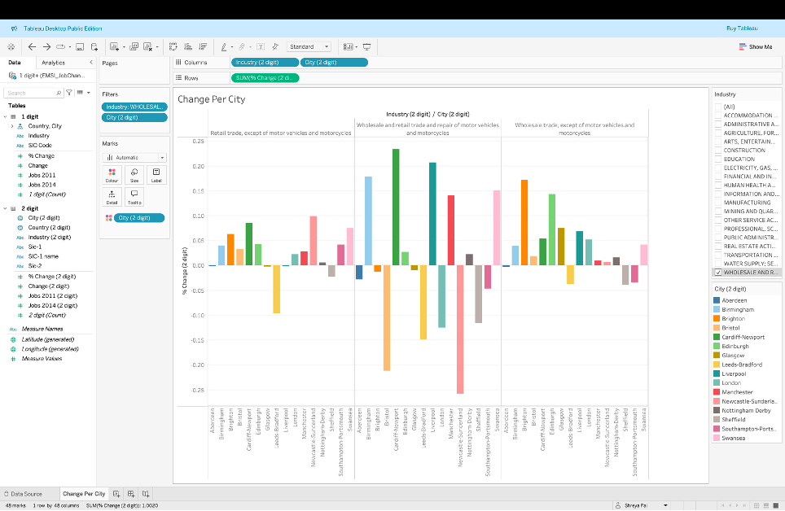
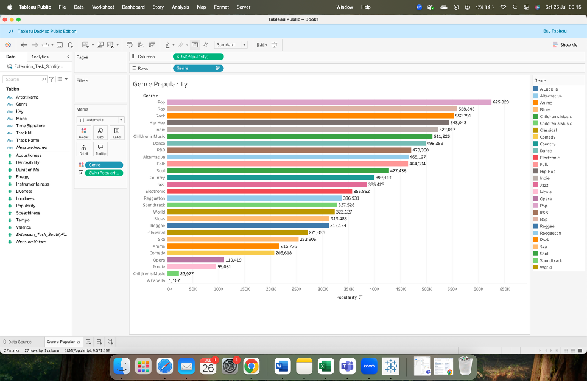
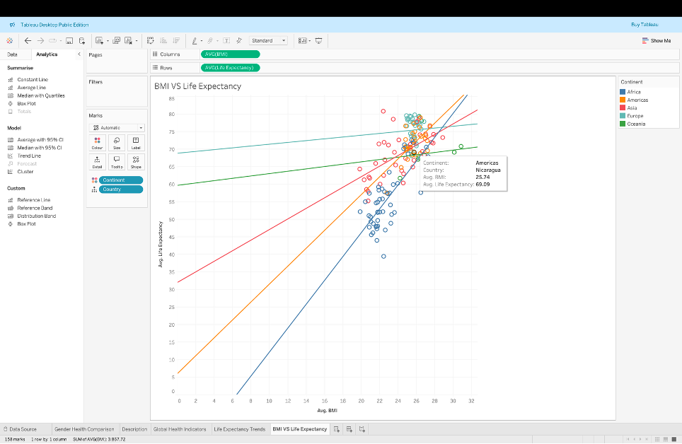
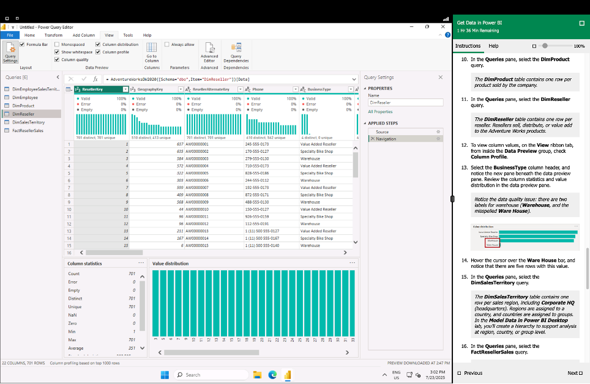
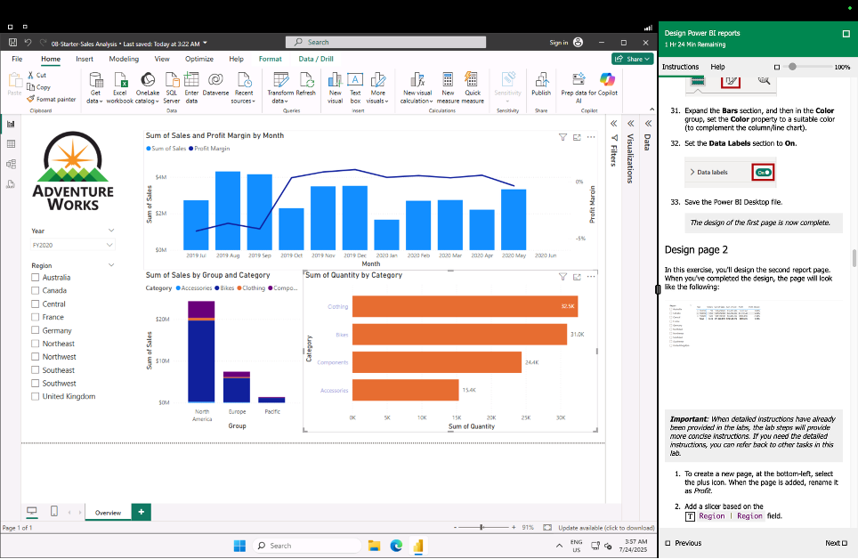
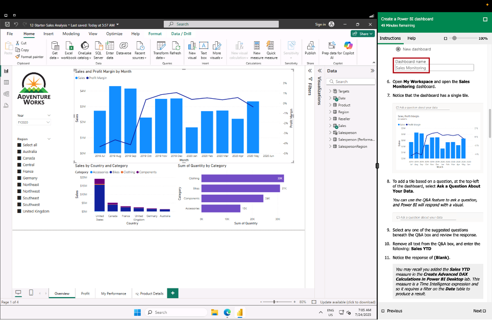

# Data Technician Workbook Week2 Summary

This workbook outlines tasks completed during a data technician course, focusing on data analysis and visualization using **Tableau** and **Power BI**. The exercises are designed to help you understand different software versions, conduct data analysis, and build reports and dashboards.

---

## **Key Tasks and Concepts**

The workbook is structured around a series of daily tasks, each building on a core data skill.

### **Tableau Analysis**

* **Task 1: Tableau Versions**: A comparison of different Tableau versions, including **Tableau Desktop**, **Tableau Server**, **Tableau Cloud**, **Tableau Prep**, and **Tableau Public**. The analysis highlights the specific, limited functionality of the free Tableau Public version.
* **Task 2: UK Job Market Dashboard**: Using the `EMSI_JobChange_UK` dataset, a dashboard was created to visualize job market changes. The dashboard includes a bar chart showing percentage change and a UK map highlighting affected cities.

  

  

* **Task 3: Spotify Data Trends**: An exploration of a Spotify dataset to identify trends in music popularity. The analysis revealed that Pop, Rap, and Rock are the most popular genres, and that **danceability** and **energy** are strong indicators of a song's popularity. It also noted the surprising popularity of composers and instrumental music.

  

* **Task 4: Global Health Analysis**: An analysis of global health data, including a reflection on how such data can be used by organizations like the NHS to improve decision-making, resource allocation, and public health initiatives. The analysis includes a dashboard showing trends in life expectancy, BMI, and cancer rates across different continents.

  

### **Power BI Labs**

* **Lab 1: Get Data in Power BI Desktop**: A guided exercise on connecting to and importing various data sources into Power BI. This lab focuses on the initial steps of a data project, including data validation and query settings.

  

* **Lab 2: Load Transformed Data**: A lab focused on the transformation process within Power BI. The task involves filtering and manipulating data, such as removing columns and replacing values, before loading it into a data model.

  

* **Lab 8: Design a Report**: A practical exercise in creating a professional report in Power BI Desktop. The lab covers designing multi-page reports with different visualizations and applying slicers for interactive filtering.

  

* **Lab 12: Create a Power BI Dashboard**: The final task, where you build a comprehensive dashboard in the Power BI service. This includes creating visualizations and using features like the Q&A box for natural language queries.

  

---

This workbook serves as a practical guide to foundational skills in data visualization and business intelligence. This included tasks demonstrate the process of data analysis from initial exploration to final dashboard creation.
