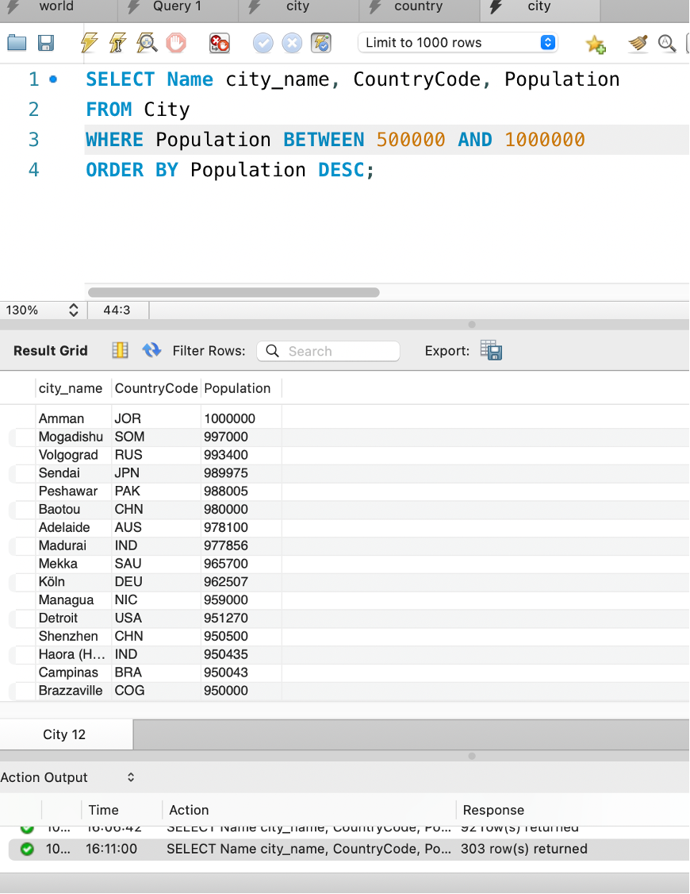

# Data Technician Workbook Week3: Database Concepts and SQL Practice

This workbook provides a comprehensive overview of fundamental database concepts and practical SQL skills. It's designed for data technicians and covers key topics, from understanding database types and relationships to writing essential SQL queries for data analysis and manipulation.

---

## 📄 Table of Contents

* **Day 1: Database Essentials**
    * **Task 1:** Core Database Concepts (Primary, Secondary, and Foreign Keys)
    * **Task 2:** Relational vs. Non-Relational Databases
* **Day 3: SQL Joins**
    * **Task 1:** Explanations and Use Cases for various `JOIN` types, including `SELF JOIN`, `RIGHT JOIN`, `FULL JOIN`, `INNER JOIN`, `CROSS JOIN`, and `LEFT JOIN`.
* **Day 4: Practical Application**
    * **Task 1: Written:** A 500-word essay on setting up a database for a small retail business, covering business requirements, schema design, implementation, data population, and maintenance.
    * **Task 2: SQL Practical:** Hands-on exercises using the `world_db` database to perform various queries.

---

## 🚀 Key Topics and Skills Covered

### Database Fundamentals
* **Primary Key:** A unique identifier for each record in a table, ensuring no duplicates.
* **Secondary Key (or Alternate Key):** A candidate key not chosen as the primary key.
* **Foreign Key:** A reference to a primary key in another table, used to link tables and maintain **referential integrity**.
* **Database Relationships:**
    * **One-to-One:** A single record in one table is linked to a single record in another (e.g., a person and their passport).
    * **One-to-Many:** A single record in one table can be linked to multiple records in another (e.g., a customer and their orders).
    * **Many-to-Many:** Multiple records in one table can be linked to multiple records in another (e.g., students and courses), often requiring a **join table** to model the relationship.

  

### Relational vs. Non-Relational Databases
* **Relational Databases (SQL):** Store data in structured tables with rows and columns. They are ideal for structured data with clear relationships, such as customer records. Examples include MySQL.
* **Non-Relational Databases (NoSQL):** Store data in flexible formats like documents, key-value pairs, or graphs. They are better suited for **unstructured or semi-structured data** like social media posts or user profiles. An example is MongoDB.

### SQL Commands and Queries
The workbook provides practical examples of SQL queries for common data tasks, including:
* **`SELECT`:** Retrieving data from tables, including specific columns (`SELECT Name`) and counting records (`SELECT COUNT(*)`).
* **`FROM`:** Specifying the table to query (`FROM City`).
* **`WHERE`:** Filtering data based on a condition (`WHERE Population > 2000000`).
* **`ORDER BY`:** Sorting results in ascending (`ASC`) or descending (`DESC`) order.
* **`LIMIT` and `OFFSET`:** Limiting the number of results and specifying a starting point for retrieval.
* **`JOIN`:** Combining rows from two or more tables based on a related column, essential for linking entities like countries and their capital cities.
* **`GROUP BY` and `AVG()`:** Grouping data and calculating aggregate values, such as the average population per country.
* **`INSERT` and `CREATE TABLE`:** Commands for populating and defining the structure of a database and its tables.

  

  
