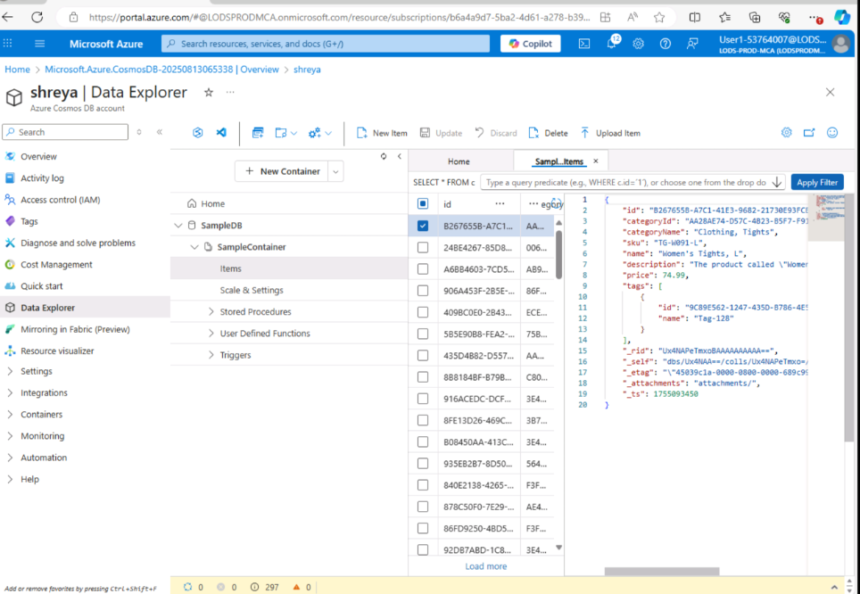
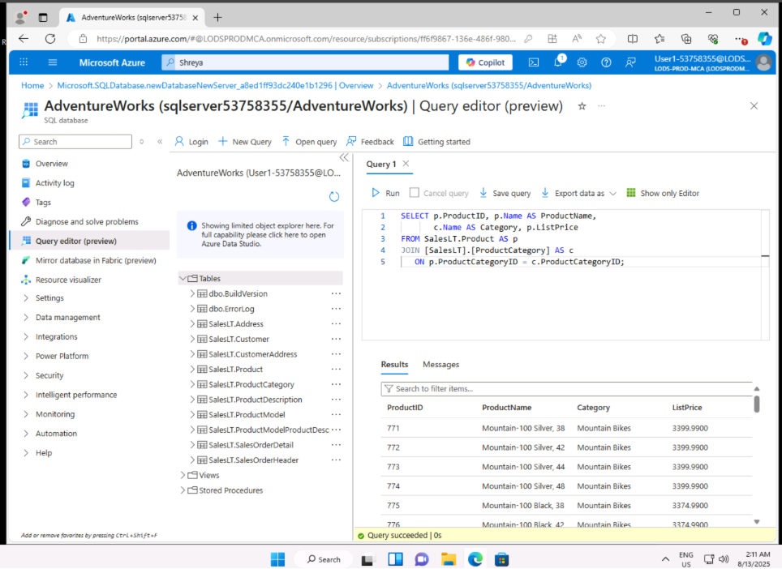
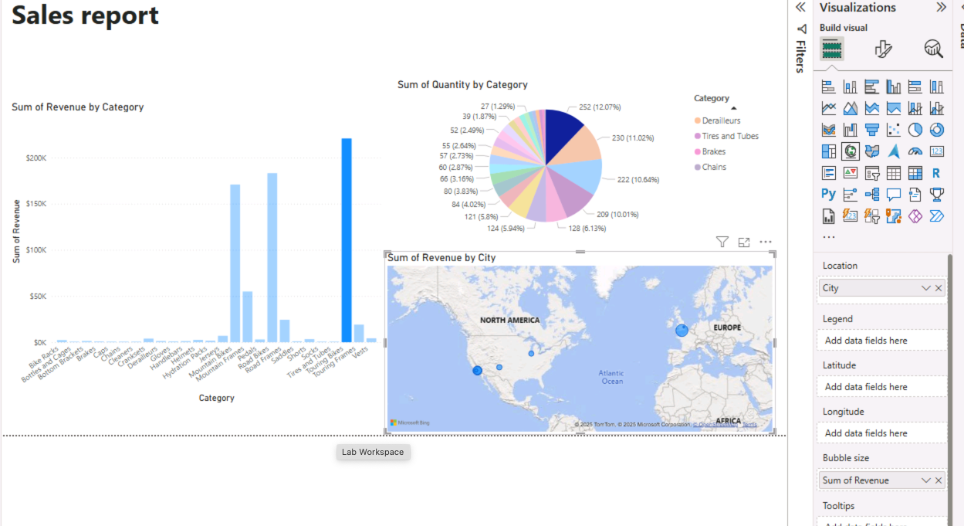

# Data Technician Workbook Week5

This repository contains a workbook covering key concepts and practical exercises for an introductory data technician course. The content is divided into four days, focusing on cloud computing, data laws, data manipulation using SQL, and Azure-specific services.

---

## 📅 Day 1: Cloud Fundamentals ☁️

This section introduces the foundational concepts of **cloud computing**. It explores what cloud computing is, its benefits for businesses, and the alternative of on-premises computing.

* **Cloud Providers**: A comparison of major cloud providers, including **Amazon Web Services (AWS)**, **Microsoft Azure**, and **Google Cloud Platform (GCP)**, highlighting their key features and best use cases.
* **Cloud Service Models**: An overview of the three main cloud service models:
    * **IaaS (Infrastructure as a Service)**: Provides virtualized computing resources over the internet, like virtual servers and storage.
    * **PaaS (Platform as a Service)**: Offers a ready-to-use platform for developing and deploying applications without managing the underlying infrastructure.
    * **SaaS (Software as a Service)**: Delivers software applications over the internet, accessible via a browser.
* **Cloud Deployment Models**: Definitions and real-world examples of different cloud environments:
    * **Public Cloud**: Shared resources owned by a third-party provider.
    * **Private Cloud**: Exclusive to a single organization, providing greater control.
    * **Hybrid Cloud**: Combines public and private clouds for flexibility.
    * **Community Cloud**: Shared among multiple organizations with similar goals or regulations.
* **Pricing**: Exercises on using Microsoft Azure's pricing and total cost of ownership (TCO) calculators to estimate cloud costs.

---

## 📜 Day 2: Data Laws and Regulations ⚖️

This part of the workbook focuses on the legal and ethical aspects of handling data.

* **Computer Misuse Act 1990**: Covers three major offenses: unauthorized access to computer systems, unauthorized access with intent to commit further crimes, and unauthorized modification of computer material.
* **Police and Justice Act 2006**: Describes new powers added to the Computer Misuse Act, such as criminalizing denial-of-service (DoS) attacks and increasing penalties for cybercrime.
* **Data Protection**: Explores employee data an employer can legally store and data requiring an employee's permission, such as health information and biometric data.
* **Intellectual Property**: Defines and provides examples of **copyright infringement** and **plagiarism**, outlining the consequences of software piracy, including legal risks and exposure to malware.

---

## 📊 Day 3: Data Exploration in Azure 🖥️

This section includes practical labs exploring data in Microsoft Azure's environment.

* **Relational Data**: A lab on exploring relational data in Azure, likely using a service like **Azure SQL Database**. The document provides examples of SQL queries used to analyze a fictional database, including:
    * Filtering data using `WHERE` and `LIKE`.
    * Aggregating data with `COUNT`, `AVG`, and `SUM`.
    * Joining tables using `JOIN`.
    * Grouping and ordering results with `GROUP BY` and `ORDER BY`.
 
    

    

* **Non-Relational Data**: A lab focusing on non-relational data in Azure, possibly using services like **Azure Blob Storage** or **Azure Cosmos DB**.

---

## 📈 Day 4: Data Engineering and Analytics ⚙️

The final day covers more advanced data tasks, including data integration and analytics using Microsoft Fabric.

* **Microsoft Fabric**: A lab that includes exercises using Microsoft Fabric to perform data engineering and analysis tasks. The included visuals show data pipelines, SQL queries, and data visualizations, suggesting a focus on:
    * Data ingestion and transformation with **Data Factory**.
    * Data querying and analysis using **SQL**.
    * Data visualization and reporting with **Power BI**.
 
   

* **Practice Exam**: Completion of a practice exam for the **Microsoft Azure Data Fundamentals (DP-900)** certification, showcasing a score and performance breakdown by section.
* **Optional Scenario**: A detailed report proposal for a fictional company, "Paws & Whiskers," outlining a data migration and analytics strategy on Azure. The report covers:
    * Relevant data laws and regulations (GDPR, DPA 2018).
    * Recommended Azure services for data storage, analysis, and integration.
    * Data types, modeling, and security considerations.
    * Additional recommendations for backup, disaster recovery, and data visualization with Power BI.
