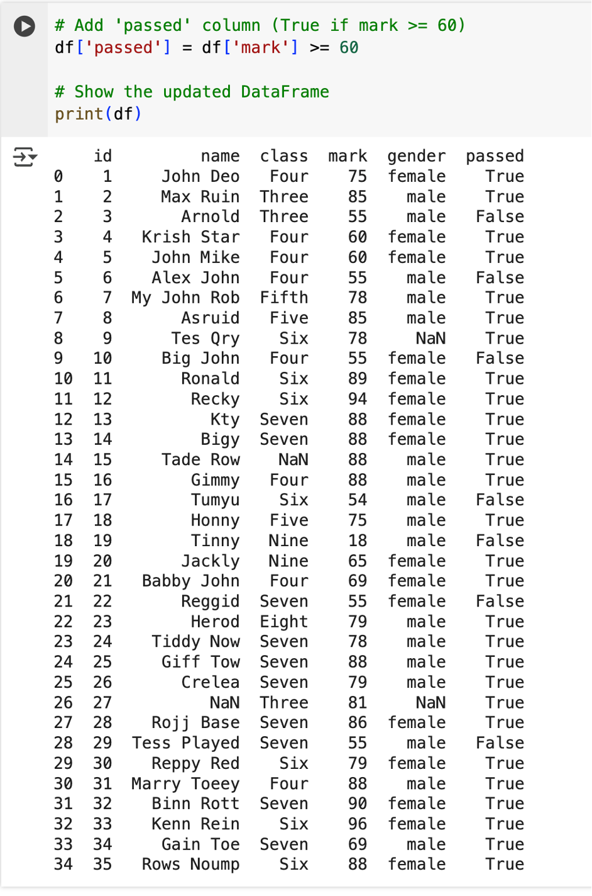
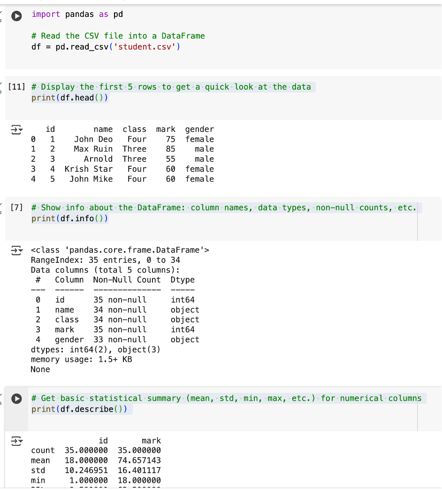
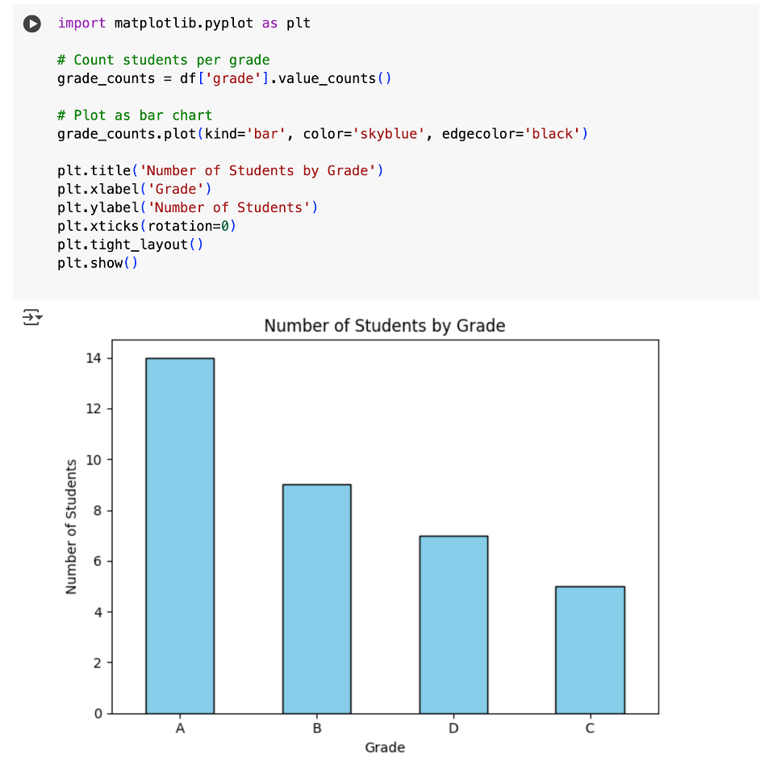
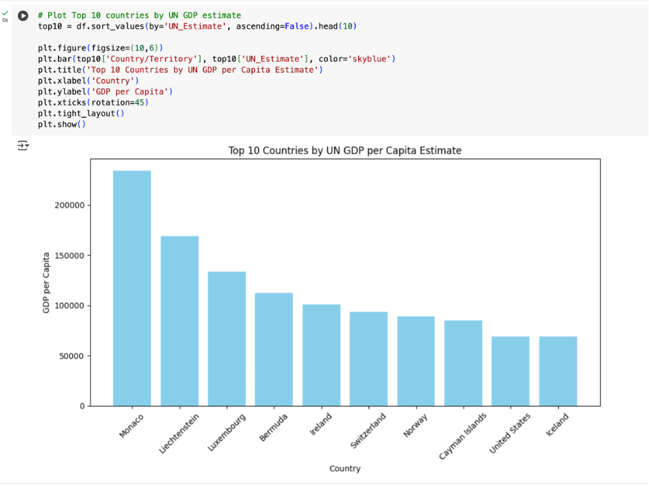

### Data Technician Workbook Week6 Summary

This document, "Data Technician Workbook," serves as a guide for hands-on exercises in Python programming and data analysis. The content is structured to support a data technician's portfolio by covering a range of fundamental to intermediate skills.

The workbook's exercises cover the following topics:

* **Python Fundamentals**: Includes a classic programming challenge, FizzBuzz, to practice control flow and basic logic.
* **Data Analysis with Pandas**: A series of tasks using a "student.csv" file to demonstrate key data manipulation techniques, including:
    * Loading and exploring dataframes.
    * Indexing, slicing, and selecting specific columns and rows.
    * Manipulating data by adding, renaming, and dropping columns.
    * Aggregating and grouping data to calculate summary statistics like mean and counts.
    * Performing advanced operations such as creating pivot tables and applying custom functions.

  

  

* **Data Visualization**: Includes an optional exercise on visualizing data using Matplotlib to create bar and pie charts to represent student grades.
* **Real-world Application**: Features a separate section with tasks using a "GDP (nominal) per Capita.csv" dataset to reinforce the skills learned and explore real-world data.

 

 
 
The exercises are designed to be completed in a hands-on manner, with space provided to paste code and the corresponding outputs. This makes the document an excellent resource for learning and demonstrating proficiency in essential data skills.
